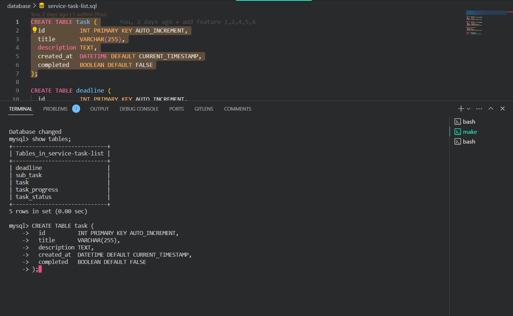
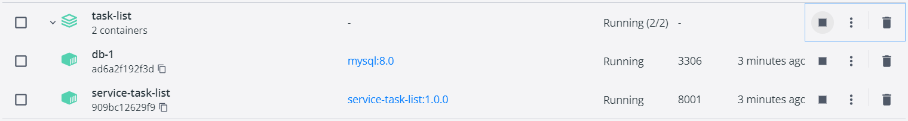
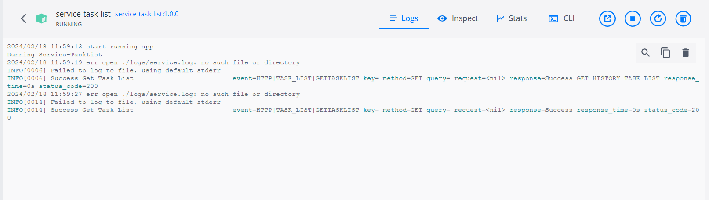

# Command Dockerize App
make build

# Evidence Result in folder ./result

# HOW TO RUN THE APP
1. make sure docker is ready
2. make build
3. make up
4. make connect for mysql. Like this picture:
5. INSERT Query to mysql from database folder. Like this: 
6. API is ready. Like this picture: 


# ERD


## Clean Architecture
This project using Go Clean Template (inspired by Clean architecture uncle Bob). Some of its advantages include:

1. how to organize a project and prevent it from turning into spaghetti code
2. where to store business logic so that it remains independent, clean, and extensible
3. how not to lose control when a microservice grows

## Project structure

### cmd/app/main.go
Configuration and logger initialization. Then the main function "continues" in internal/app/app.go.

### config
Configuration. First, config.yml is read, then environment variables overwrite the yaml config if they match. The config structure is in the config.go. The env-required: true tag obliges you to specify a value (either in yaml, or in environment variables).

For configuration, we chose the cleanenv library. It does not have many stars on GitHub, but is simple and meets all the requirements.

### internal/app
There is always one Run function in the app.go file, which "continues" the main function.

This is where all the main objects are created. Dependency injection occurs through the "New ..." constructors (see Dependency Injection). This technique allows us to layer the application using the Dependency Injection principle. This makes the business logic independent from other layers.


### internal/controller
Server handler layer (MVC controllers).
REST http (gorilla mux framework)
Server routers are written in the same style:

Handlers are grouped by area of application (by a common basis)
For each group, its own router structure is created, the methods of which process paths
The structure of the business logic is injected into the router structure, which will be called by the handlers
internal/controller/http
Simple REST versioning. For v2, we will need to add the http/v2 folder with the same content. And in the file internal/app add the line:

```
handler := gin.New()
v1.NewRouter(handler, t)
v2.NewRouter(handler, t)
```

### internal/entity
Entities of business logic (models) can be used in any layer. There can also be methods, for example, for validation.

### internal/usecase
Business logic.

### internal/usecase/repo
A repository is an abstract storage (database) that business logic works with.

## API Endpoints

### GET /tasks
- Description: Get all tasks
- Response:
  - Status: 200 OK
  - Body: Array of task objects

### GET /tasks/history
- Description: Get all tasks history
- Response:
  - Status: 200 OK
  - Body: Array of task objects

### POST /tasks
- Description: Create a new task
- Request Body:
  - task: Task object
- Response:
  - Status: 201 Created
  - Body: Created task object

### PUT /tasks/{id}
- Description: Update a specific task by ID
- Parameters:
  - id: ID of the task
- Request Body:
  - task: Updated task object
- Response:
  - Status: 200 OK
  - Body: Updated task object

### DELETE /tasks/{id}
- Description: Delete a specific task by ID
- Parameters:
  - id: ID of the task
- Response:
  - Status: 200 Status ok

### PUT /tasks/{id}/checklist
- Description: checklist a specific task by ID
- Parameters:
  - id: ID of the task
- Response:
  - Status: 200 Status ok

### POST /tasks/{id}/subtasks/{subtaskid}
- Description: Create a new subtask
- Request Body:
  - task: Task object
- Response:
  - Status: 201 Created
  - Body: Created task object

### PUT /tasks/{id}/substasks/{subtaskid}
- Description: Update a specific subtask by subtaskID and taskid
- Parameters:
  - id: ID of the task
  - subtaskid: id subtask
- Request Body:
  - task: Updated task object
- Response:
  - Status: 200 OK
  - Body: Updated task object

### DELETE /tasks/{id}/{subtaskid}
- Description: Delete a specific task by subtaskID and taskid
- Parameters:
  - id: ID of the task
  - subtaskid: id of the subtask
- Response:
  - Status: 200 Status ok

### PUT /tasks/{id}/subtasks/{subtaskid}/checklist
- Description: checklist a specific task by subtask ID and checklist.
- Parameters:
  - id: ID of the task
  - subtaskid: id of the subtask
- Response:
  - Status: 200 Status ok


## POSTMAN COLLECTION
postman-collection-TASKLIST.JSON in the root directory of this project.