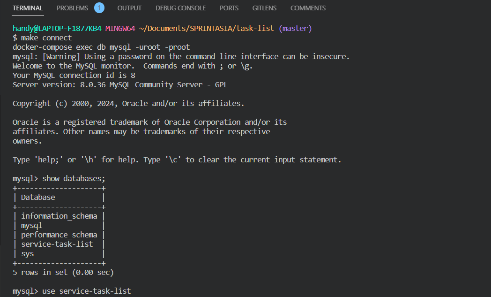

# Command Dockerize App
make build

# Evidence Result in folder ./result

# HOW TO RUN THE APP
1. make sure docker is ready
2. make build
3. make up
4. make connect for mysql. Like this picture:
5. INSERT Query to mysql from database folder. Like this: 
6. API is ready. Like this picture: 

## API Endpoints

### GET /tasks
- Description: Get all tasks
- Response:
  - Status: 200 OK
  - Body: Array of task objects

### GET /tasks/history
- Description: Get all tasks history
- Response:
  - Status: 200 OK
  - Body: Array of task objects

### POST /tasks
- Description: Create a new task
- Request Body:
  - task: Task object
- Response:
  - Status: 201 Created
  - Body: Created task object

### PUT /tasks/{id}
- Description: Update a specific task by ID
- Parameters:
  - id: ID of the task
- Request Body:
  - task: Updated task object
- Response:
  - Status: 200 OK
  - Body: Updated task object

### DELETE /tasks/{id}
- Description: Delete a specific task by ID
- Parameters:
  - id: ID of the task
- Response:
  - Status: 200 Status ok

